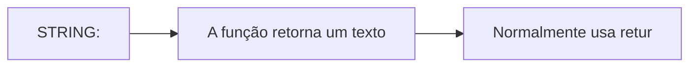
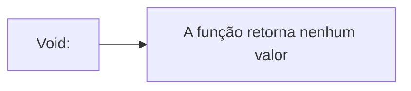

## 1- Oque é uma função?
Nós utilizamos uma função para o codigo não ficar se reptindo varias vezes. Ela sera uma palavra que nós transformamos em uma função para conseguir puxar essa palavra mais de uma vez.
EX:
```php
$notaA = 10 //$notaA seria uma função
$notaB = 10
$media = ($notaA + $notaB) /2

echo "Sua média foi $media !!!";
```

---
---

## 2- Princípio DRY: Por que repetir o mesmo bloco de código em várias partes do sistema pode causar problemas de manutenção? Como uma função ajuda a evitar essa repetição?
Porque reptir o codigo varias vezes pode multiplicaros erros ocorrendo em multiplas alterações na intenção de concertar o codigo. O uso da função ajuda porque o codigo centraliza nessa parte, e você alterando ela você atualiza o codigo inteiro.

---
---

## 3-Parâmetros e retorno: Explique a diferença entre um parâmetro e um valor retornado por uma função. 

Os parâmetros $preco e $quantidade são os dados de entrada que servem para uma função funcionar. O retorno (return $preco * $quantidade) é o dado de saída ou seja, o resultado final devolvido por ela.

```php
function calcularTotal(float $preco, int $quantidade): float {  //parametro
    return $preco * $quantidade;  //retorno
}
```
---
---
## 4-Tipagem: Identifique o tipo de cada elemento na declaração.
```php
 function cadastrar(string $nome, int $idade): bool.
```
**cadastrar**: nome

**$nome**: string

**$idade**: int

**bool**: boleano

---
---
## 5-void e return: Qual é a diferença entre uma função que retorna string e uma função que retorna void? Dê um exemplo de uso para cada uma.


### string:


### void:

---
---

## 6-Escopo: Por que a função abaixo não consegue acessar $cliente diretamente? Explique duas formas de corrigir o código e indique qual é a mais recomendada.

A função não acessa **$cliente** porque ele está no escopo global, enquanto a função tem seu próprio escopo.

```php
$cliente = "Mariana";//escopo global

function exibirCliente(string $cliente): string {
    return $cliente;
}

echo exibirCliente($cliente);
```
---
---

## 7-Referência: O que muda quando um parâmetro é declarado como float &$valor? Explique a diferença entre alterar uma cópia e alterar a variável original.

O & meio que puxa o valor auterando a variavel original. Sem o & a função apenas copia esse valor.

---
---

## 8-Funções nativas: Escolha cinco funções da tabela deste material e descreva: categoria, finalidade, parâmetros principais e valor retornado.
 
 strlen() -> Strings -> conta caracteres -> recebe um texto -> retorna um número.

strtoupper() -> Strings → deixa o texto maiúsculo -> recebe um texto -> retorna um texto.

count() -> Arrays -> conta elementos -> recebe um array -> retorna um número.

round() -> Matemática -> arredonda números -> recebe um número -> retorna um número.

date() -> Data -> mostra/formata uma data -> recebe um formato -> retorna um texto.