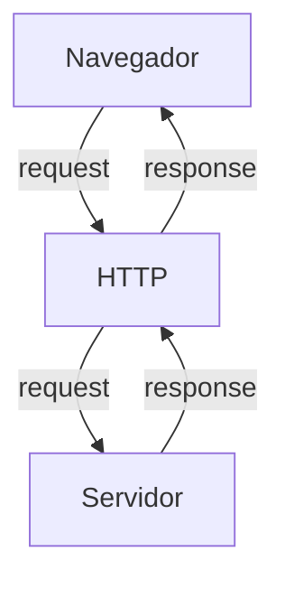
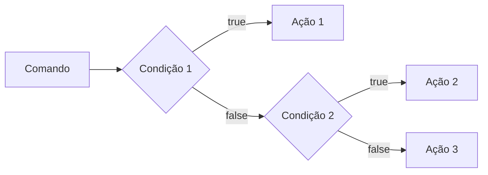
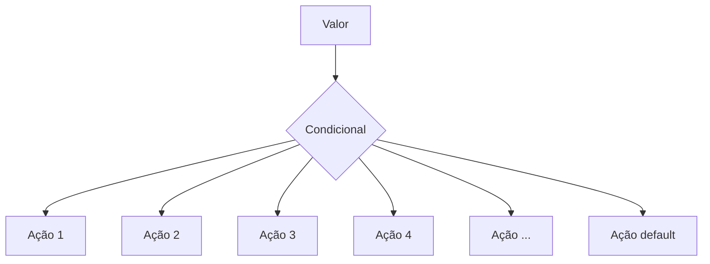
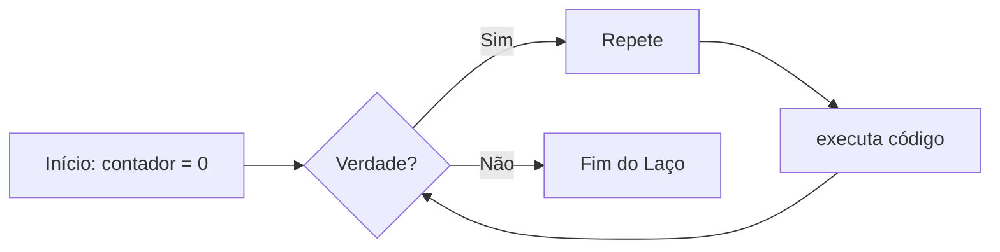

# Curso BackEnd - 225h - Técnico em Desenvolvimento de Sistemas - SENAI

Profº Diogo TB

Escola SENAI Americana

2º Semestre 2026

## Objetivos do Curso

- Desenvolver Aplicações web Server Side, utilizando a linguagem PHP;
- Aplicar Sisntaxe Nativa PHP (Vanilla);
- Manipulação HTTP;
- Persistência de Dados;
- Segurança contra SQL Injection/CSRF;
- Refatoração em POO (Programação Orientada ao Objeto);
- Arquitetura MVC (Model, View, Controller);
- Utilização do FrameWork Laravel; 

obs: framework - um conjunto de bibliotecas que oferecem uma solução completa para o desenvolvimento de alguma coisa

## Cronograma do Semestre

Carga Horária: 105h 1º Semestre e 120h 2º Semestre

Duração: 20 Semanas 1º Semestre e 20 Semanas 2º Semestre

---

### Semana 1: Introdução ao BackEnd e Configuração do Ambiente PHP

#### O que é BackEnd?

>Obs: backend é quando a interface do usuario envia um comando/uma pergunta e o backend envia a resposta. Ou seja backend é a resposta da aqusição de cliente.

O back-end é a parte de uma aplicação que o usuário não vê, mas que faz tudo funcionar por trás das telas.

O Back-End é a parte de um sistema que funciona nos servidores, sendo responsável por executar a lógica da aplicação, processar informações e armazenar dados. 

Além disso, o BackEnd é responsável por atender ás solicitações do Frontend.

**Sobre o mercado atual:** o cenário é bom, mas mais exigente do que era. Quem conhece só o básico enfrenta mais concorrência. Quem alia backend sólido com IA aplicada, cloud e inglês está num patamar completamente diferente — vagas internacionais remotas são uma realidade pra esse perfil.

O Backend é formado pelo servidor, banco de dados, lógica de programação com APIs e linguagens de programação/frameworks. Esses componentes trabalham juntos para processar dados, armazenar informações e garantir o funcionamento da aplicação.

**Para que serve**

- Processar lógica de negócio: regras, cálculos, validações (ex: calcular frete, aplicar desconto, validar login)
- Gerenciar banco de dados: salvar, buscar, atualizar e deletar informações
- Autenticação e autorização: controlar quem pode acessar o quê (login, senhas, permissões)
- Fornecer APIs: criar "pontes" (endpoints) para o frontend ou outros sistemas consumirem dados
- Integração com serviços externos: pagamentos, e-mails, notificações, APIs de terceiros
- Segurança: proteger dados sensíveis, evitar ataques (SQL injection, XSS, etc.)
- Escalabilidade e performance: garantir que o sistema aguente muitos usuários ao mesmo tempo.


**Principais Tecnologias Linguagens de programação:** 
Ferramentas usadas para escrever o código do servidor, como Python, Node.js (JavaScript), Java e PHP.APIs: Os "caminhos" que permitem que o que você vê no celular converse com o servidor.

**Areas de Atuação**
- Fintechs e Bancos
- Segurança, transações, alta escala 
- E-commerce
- Catálogo, pedidos, pagamentos
- Healthtechs
- Prontuários, telemedicina
- SaaS / Startups
- Backend é o coração do produto
- Logística
- Rastreio, rotas, tempo real
- Educação
- Plataformas, conteúdo, usuários

#### O Ciclo de Vida da Requisição HTTP

##### O que é HTTP?

*HTTP*, Hypertext Transfer Protocol, é um protocolo de comunicação utilizado para transferência de informações na WWW (World wide Web) e em outros sistemas de redes.

O HTTP é a base para que o cliente e um servidor web troquem informações. Ele permite a requisição e a resposta de recurso como, imagens, arquivos e textos.




#### Como Funciona na Prática o BackEnd

- **Ação do Usuário**: Envia uma Solicitação pela UI(Interface do Usuário). Exemplo de UI: Tela do Celular, Navegador da Internet, Alexa, IOT ...
- **Enviar uma Requisição**: A UI transforma ação do Usuário em uma Requisição HTTP.
- **O Processamento BackEnd**: O Código BackEnd recebe o pedido, valida os dados e decide o que fazer. Ex: consultar uma informação no BD(Base de Dados).
- **Resposta**: O servidor devolde o resultado para a UI. Ex: Um Login Autorizado, Confirmação de uma Compra...

#### Tipos de Requisição HTTP

Os tipos de requisição HTTP indicam a ação que o usuário deseja executar no servidor. As principais ações são:

- **GET**: Pede dados de um lugar especifico do servidor. "Não Faz Alterações no Servidor"
- **DELETE**: Apaga um Dados do Servidor.
- **POST**: Envia dados novo para *criar* algo ou processar informações no servidor.
- **PUT/PATCH**: Modificaar um dados já existente. 

---

#### Iniciando o PHP

**PHP** (HyperText PreProcessor) é uma linguagem de programação interpretada e open source, focada no desenvolvimento de sistemas para web, pode ser usada junto com HTML para criação de páginas web dinâmicas.

O PHP de fato é yma das linguagens de programação mais populares da atualidade. Ela permite que você crie aplicações web robustas, de uma muito simplificada e direta. A linguagem tem diversos recursos que facilitam e aceleram o ´processo de desenvolvimento de sites e sistemas para web. E além od mais, ela ainda tem um ótimo ecossistema, uma excelente comunidade e um grande mercado de trabalho.

##### Instalando o PHP

- Fazer o Download do PHP (php.net)
- ZIP - NTS(Non Thread Safe) 8.5
- Descompactar o Arquivo do PHP na pasta C:src\php (Para Descompactar usar o 7Zip = Melhor) => nunca salvar arquivo ou programas na raiz do sistema(C:)
- Adicionar a Pasta do PHP(C:\src\php) as Variáveis de Ambiente do Sistema (PATH)
- Verificar a Instalação rodando o comando *php --version*

##### Criando Minha Primeira Aplicação em PHP

1. Antes de começar a Codar:
-Preparar meu VSCode
    -Criar um profile proprio para PHP
    -Instalar Extensões Necessárias para transformar o VScode em uma IDE :
        -PHP Intelephense -> Permite a utilização de Snippets(Atalhos de codigos)
        -PHP Debug -> Ajuda a encontrar erros de codigos
        -PHP Cs Fixer -> Formatação de códigos (Identação)
        -PHP Sever -> Ajuda na crição de um servidor local para PHP.
    -Desabilitamos o PHP Nativo do VSCode (@builtin PPHP)

2. Hello World (**MUITO IMPORTANTE**)

## Esudo de Variáveis e Constates em PHP

Declarar variáveis é alocar um espaço na memória que permite a inclusão e manipulação de dados.

**Variáveis**

- devem ser declaradas usando "$" ane sdo no me da variável
- são não tipadas (não precisar declarar o tipo dela na criação).
- podem ser String, Numéricas (Interger no float), booleanas e nulas. Não permitem declaração de undefiend
- usar o "declare(strict_tupes=1);" na primeira linha do arquivo; -> blinda o sistemas contra conflitos de tipos de variáveis.

**constantes**

- não podem ser mudadas ou redeclaradas após a criação
- podem ser criadas usando "const" ou "define"
- não permite interpolação

## Estudo de operadores

**aritimeticos**: são usados para realizar cálculos

|operadores | nome | exemplo | resultados |
|-----------|------|---------|------------|
|     +     |adição|  10+5   |    15      |
|     -     |subtrção| 10-5  |    5       |
|     *     |multiplicação|10*5|   50     |
|     /     |divisão| 10/5 | 2 |
| % | Modulo(Resto) | 10%3 | 1 (10 div 3 da 3, sobra 1) |
| ** | Expoente | 2**3 | 8(2 elevado a 3) |

>Obs: O operador % é o melhor amigo de um programador, permite ordenar listas e organizar fias e planilhas.


**relacionais**: Permite relacionamento entre dois ou mais valores, o resultado de uma operação é sempre um booleano (verdadeiro ou falso)
 
| Operador | Significado | Exemplo | Resultado |
| - |  - | - | - |
| > | Maior que | 18 > 18 | false |
| >= | Maior ou igual a | 18 >= 18 | true |
| < | Menor que | 10 < 20 | true |
| <= | Menor ou igual a | 10 <=5 | false |
| == | Comparação de Valor | "10"==10 |  true | 
| === | Comparação Estrita | "10"===10 | false |
| != | Diferente | "10"!=10 | false |
| !== | Estritamente Diferente | "10"!==10 | true | 
---

**lógicos** : permitem a combinação entre senteças.

- Operador AND (E) -> && : para o resultado ser verdadeiro, Todas as Combinações precisam ser verdadeira
    - true && true -> true
    - true && false -> false

- Operador OR (OU) -> || : para o resultado ser verdadeiro, Basta apenas uma condição ser verdadeira
    - false || true -> true
    - false || false -> false

- Operador NOT (Não) => ! : Inverte a lógica da Operação, 
    - !true -> false
    - !false -> true

    ---

    ## Estrutura de controle de dados (condicionais e repetição)

    - **conteudo**: Estrutura `if`, `else` e `elseif`, operadores ternários, `match` -> substituto do `switch/case`,loops `for`,`while`, `do-while` e `foreach`

    ### Estrutura de controle de dados ajudam no processo de automatização em programas e sistemas

    #### Condicionais (if, else, elseif)

    **formas de uso**
    -uso do *if* apenas:
    ex: aplicar desconto de 10% em compras de 100 reais;

    ```mermaid
    graph LR
    A[Comando]-->B[Condição]--C[Ação]

    ```
    ----
    ```php
    if($valordacompra > 100){
        $valorFinal = $valordacompra * 0.9;
    } 
    ```
    ---
    -Uso de `if` e do `else` Exemplo: aplicar um desconto de 10% para compras acima de 100reais e 5% para as demais compras

    ```mermaid
    graph LR
    A[comando]-->B[condição]
     B --> |true| C[Ação 1]
    B --> |false| D[Ação 2]

```

```php

if($valorCompra > 100){
    $valorFinal = $valorCompra * 0.9;
} else {
    $valorFinal = $valorCompra * 0.95;
}

```

-Uso `elseif` (If Encadeado) -> estrutura usada para a manipulação de dados em dus ou mais condicioanais.
EX: compras acima de 200 reais tem 15% de desconto
compras acima de 10 reais 10% de desconto
e as demais compras tem 5% de desconto 




```php

if($valorCompra > 200) {
    $valorFinal = $valorCompra * 0.85;
} elseif($valorCompra > 100) {
    $valorFinal = $valorCompra * 0.9;
} else {
    $valorFinal = $valorCompra * 0.95;
}

```

>OBS: sempre usar `elseif` para situações que precisam mais de uma condição, ou seja, fazer encadeamento das condições.

-Uso *ERRADO* do if 
```php 

if($valorCompra > 200) {
    $valorFinal = $valorCompra * 0.85;
}
if($valorCompra > 100) {
    $valorFinal = $valorCompra * 0.9;
} else {
    $valorFinal = $valorCompra * 0.95;
}
```

#### Operadores ternarios 
um atalho para a estrutura condicional `if/else`, normalmente escrito em uma unica linha de codigo.
`condição ? verdadeira : falsa`
perfeita para decisões curtas de uma linha de comando
EX: Verificar se a pessoa é maior ou menor de (18);

```php

$idade = 10;
//O formato é (Condição) ? Verdadeiro : Falso;

$status = ($idade>=18) ? "Maior de Idade" : "Menor de Idade";

$status2 = ($idade>=60) ? "Idoso" : ($idade>=18) ? "Adulto" : "Criança" ;

echo $status //
```
#### Expressão condicional `match` (PHP 8)

No mercado atual de PHP, não se uma mais uma `Switch/Case` para chegar valores fixos, usa-se o `match`. Ele compara um valor e retoran diretamente o resultado caso atenda a condição.


Exemplo: Selecionar o Dia da Semana a partir de um Nº 

```php

$diaSemanaNum = date("W"); // pega o Dia da Semana em formato numérico

$nomeDiaSemana = match($diaSemanaNu) {
    "0" => "Domingo",
    "1" => "Segunda",
    "2" => "Terça",
    "3" => "Quarta",
    "4" => "Quinta",
    "5" => "Sexta",
    "6" => "Sábado",
    "default" => "Dia Inválido"
};

echo " Hoje é : $nomeDiaSemana";

```
##### Laços de Repetição

Um laço de repetição faz com que um bloco de código rode várias vezes até que uma condição mande parar. 

- O Laço while (Enquanto)

Ele verifica se a condição é verdadeira ANTES de entrar no laço. Ideal quando você não sabe exatamente quantas vezes vai rodar o laço. 



-O Laço `do-While`
